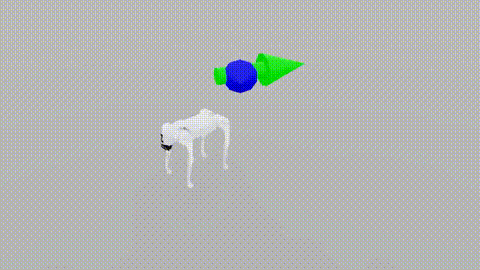
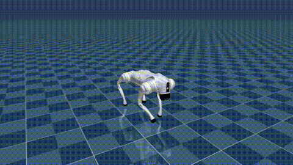

# Sim-to-Sim Transfer for Legged Robots

Transfer reinforcement learning locomotion policies trained in **Isaac Lab** (NVIDIA PhysX) to **MuJoCo** without retraining. Evaluated on three robots with fundamentally different morphologies:

- **Go2** (Unitree quadruped): 12 actuated joints, simple joint mapping
- **Cassie** (Agility Robotics biped): 10 actuated joints + 2 passive ankle joints via 4-bar linkage
- **Flamingo** (Two-wheel-legged robot): 8 actuated joints, hybrid position-velocity control, dynamically unstable

The project systematically investigates transfer challenges and evaluates three improvement methods: domain randomization, actuator networks, and rapid motor adaptation (RMA).

<table>
<tr>
<td align="center"><b>Isaac Lab (Training)</b></td>
<td align="center"><b>MuJoCo (Deployment)</b></td>
</tr>
<tr>
<td align="center"></td>
<td align="center"></td>
</tr>
<tr>
<td align="center"><i>Go2 policy trained in Isaac Lab</i></td>
<td align="center"><i>Same policy deployed in MuJoCo</i></td>
</tr>
</table>

## Repository Structure

```
sim2sim_project/
├── source/
│   ├── go2/                     # Go2 Isaac Lab environment definitions & configs
│   ├── cassie/                  # Cassie Isaac Lab environment definitions & configs
│   └── flamingo/                # Flamingo Isaac Lab environment (CO-RL framework)
├── scripts/
│   ├── rsl_rl/                  # Training scripts (train.py, play.py)
│   ├── go2/                     # Go2 policy export & MuJoCo deployment
│   ├── cassie/                  # Cassie policy export & MuJoCo deployment
│   └── flamingo/                # Flamingo policy transfer scripts
├── experiments/go2/             # Evaluation framework & analysis scripts
├── actuator_net/                # Actuator network: data collection & training
├── rma/                         # Rapid Motor Adaptation: training & deployment
├── external/agility_cassie/     # Cassie MuJoCo model (MJCF + meshes)
├── Two-wheel-Legged-Bot/        # Flamingo robot models and transfer scripts
├── docker/                      # Docker environment setup
└── docs/                        # Technical documentation
```

## Prerequisites

- **NVIDIA Isaac Lab** 2.1+ (for training)
- **MuJoCo** 3.x (for deployment)
- **Python** 3.10+
- **PyTorch** 2.x
- **RSL-RL** (Isaac Lab's RL framework)

## Installation

### Step 1: Clone and Install Packages

```bash
# Clone the repository
git clone https://github.com/bpbb/sim2sim_project.git
cd sim2sim_project

# Activate your Isaac Lab conda environment
conda activate env_isaaclab

# Check if packages are already installed
pip list | grep -E "(cassie|go2|lab.flamingo)"

# Install Isaac Lab environment packages
# IMPORTANT: Do NOT use --user flag as it can cause PyTorch version conflicts!
# Note: If packages are already installed, you can skip this step
pip install -e source/cassie
pip install -e source/go2 --no-deps
pip install -e Two-wheel-Legged-Bot/isaac_lab_envs --no-deps  # Flamingo environment (CO-RL)
```

### Step 2: Verify Setup

```bash
# Run comprehensive setup verification
bash scripts/verify_setup.sh
```

This script checks:
- ✓ Python version (3.10+)
- ✓ Conda environment activation
- ✓ PyTorch and torchvision versions
- ✓ **No mixed installations** (critical for avoiding "operator torchvision::nms does not exist")
- ✓ CUDA availability
- ✓ Required packages (cassie, go2, lab.flamingo)
- ✓ Isaac Lab installation
- ✓ MuJoCo installation

### Troubleshooting

#### Error: "operator torchvision::nms does not exist"

This happens when PyTorch and torchvision are installed in different locations (conda env vs user site-packages).

**Fix:**
```bash
# Run the automatic fix script
bash scripts/fix_pytorch_conflict.sh

# Or manually fix:
conda activate env_isaaclab
pip uninstall torch torchvision torchaudio
pip install torch torchvision torchaudio --index-url https://download.pytorch.org/whl/cu121

# Verify the fix
bash scripts/verify_setup.sh
```

#### Permission Errors During Installation

If you get "Permission denied" errors, make sure:
1. You're in the conda environment (`conda activate env_isaaclab`)
2. You're **NOT** using `--user` flag
3. You're not trying to install to system directories

```bash
# Wrong (causes conflicts):
pip install --user -e source/cassie

# Correct:
conda activate env_isaaclab
pip install -e source/cassie
```

## Quick Start

The pipeline has three stages: **Train** (Isaac Lab) -> **Export** (TorchScript) -> **Deploy** (MuJoCo).

### 1. Training (Isaac Lab)

```bash
# Go2 - Baseline with domain randomization (5K iterations)
python scripts/rsl_rl/train.py \
    --task Isaac-Velocity-Flat-Go2-Sim2Sim-v0 \
    --num_envs 4096 --max_iterations 5000

# Go2 - Moderate DR for better transfer robustness
python scripts/rsl_rl/train.py \
    --task Isaac-Velocity-Flat-Go2-Sim2Sim-Moderate-v0 \
    --num_envs 4096 --max_iterations 5000

# Cassie - Passive ankle (matches MuJoCo 4-bar linkage, 10 actions)
python scripts/rsl_rl/train.py \
    --task Isaac-Velocity-Flat-Cassie-Sim2Sim-Passive-v0 \
    --num_envs 4096 --max_iterations 30000

# Cassie - Balance standing task
python scripts/rsl_rl/train.py \
    --task Isaac-Balance-Standing-Cassie-v0 \
    --num_envs 4096 --max_iterations 20000

# Flamingo - Flat terrain with stand and drive (CO-RL, 3-frame stacking)
python Two-wheel-Legged-Bot/main/scripts/train.py \
    --task Flamingo_Flat_Stand_Drive \
    --num_envs 4096 --max_iterations 5000
```

Checkpoints are saved to `logs/<robot>/rsl_rl/<task>/<timestamp>/`.

### 2. Export Policy

```bash
# Go2
python scripts/go2/export_policy.py \
    --checkpoint logs/go2/rsl_rl/go2_sim2sim/<run>/model_4999.pt \
    --output logs/go2/policies/baseline.pt

# Cassie (passive ankle variant)
python scripts/cassie/export_policy_passive.py \
    --checkpoint logs/cassie/rsl_rl/cassie_sim2sim/<run>/model_29999.pt \
    --output logs/cassie/policies/passive.pt

# Flamingo (policy already exported in .pt format from CO-RL training)
# Use checkpoint from logs/co_rl/Flamingo_Flat_Stand_Drive/ppo/*/model_4999.pt
```

### 3. Deploy in MuJoCo

```bash
# Go2 - PD control
python scripts/go2/deploy_mujoco.py scripts/go2/go2_isaaclab.yaml

# Go2 - With actuator network
python scripts/go2/deploy_mujoco.py scripts/go2/go2_isaaclab.yaml --actuator_net

# Cassie - Passive ankle policy
python scripts/cassie/deploy_mujoco.py scripts/cassie/cassie_passive.yaml

# Flamingo - Hybrid position-velocity control (requires fixing 8 bugs + geometry match)
python Two-wheel-Legged-Bot/main/scripts/transfer_flamingo_sim2sim.py \
    --policy logs/co_rl/Flamingo_Flat_Stand_Drive/ppo/*/model_4999.pt \
    --pd_scale 1
```

Deployment YAML configs specify: policy path, MuJoCo scene, PD gains, joint mapping, and observation construction parameters.

## Available Environments

### Go2 (Quadruped)

| Environment ID | Method | Description |
|---|---|---|
| `Isaac-Velocity-Flat-Go2-Sim2Sim-v0` | Baseline DR | Minimal domain randomization |
| `Isaac-Velocity-Flat-Go2-Sim2Sim-Moderate-v0` | Moderate DR | Friction, mass, actuator gain randomization |
| `Isaac-Velocity-Flat-Go2-Sim2Sim-Aggressive-v0` | Aggressive DR | Widest randomization ranges |
| `Isaac-Velocity-Rough-Go2-Sim2Sim-v0` | Terrain | Rough terrain, no height scan |
| `Isaac-Velocity-Rough-Go2-Sim2Sim-Moderate-v0` | Terrain + DR | Rough terrain with moderate DR |
| `Isaac-Velocity-Rough-Go2-Sim2Sim-Aggressive-v0` | Terrain + DR | Rough terrain with aggressive DR |
| `Isaac-Velocity-Flat-Go2-Sim2Sim-RMA-v0` | RMA | Rapid Motor Adaptation with privileged critic |
| `Isaac-Velocity-Flat-Go2-Sim2Sim-ActuatorNet-v0` | ActuatorNet | Learned actuator dynamics from MuJoCo |

### Cassie (Biped)

| Environment ID | Method | Description |
|---|---|---|
| `Isaac-Velocity-Flat-Cassie-Sim2Sim-v0` | Baseline | Active ankles (12 actions, 48 obs) |
| `Isaac-Velocity-Flat-Cassie-Sim2Sim-Moderate-v0` | Moderate DR | Wider randomization ranges |
| `Isaac-Velocity-Flat-Cassie-Sim2Sim-Aggressive-v0` | Aggressive DR | Maximum robustness training |
| `Isaac-Velocity-Flat-Cassie-Sim2Sim-Passive-v0` | Passive Ankle | Matches MuJoCo 4-bar (10 actions, 46 obs) |
| `Isaac-Velocity-Flat-Cassie-Sim2Sim-Passive-Enhanced-v0` | Passive + DR | Enhanced domain randomization |
| `Isaac-Velocity-Flat-Cassie-Sim2Sim-Passive-Improved-v0` | Passive + Curriculum | Conservative DR with curriculum |

### Flamingo (Two-Wheel-Legged Robot)

| Environment ID | Method | Description |
|---|---|---|
| `Flamingo_Flat_Stand_Drive` | Baseline | Hybrid control, 3-frame stacking (88 obs, 8 actions) |
| `Flamingo_Flat_Stand_Drive_DR` | Domain Randomization | Enhanced DR for robust transfer |

**Key Features**:
- 8 DOF: 4 hip/shoulder (position control) + 2 leg joints (position, gear -1.5) + 2 wheels (velocity control)
- 3-frame temporal stacking: newest first [28×3 + 4 commands = 88 dims]
- Gear ratio -1.5 for leg joints affects both observations and PD control
- Actuator delays: 0-4 step random delays in training

All environments have a corresponding `-Play-v0` variant for inference with fewer parallel environments.

## Robot Comparison

| **Feature** | **Go2** | **Cassie** | **Flamingo** |
|---|---|---|---|
| **Type** | Quadruped | Biped | Two-wheel-legged |
| **Stability** | Statically stable | Statically stable | Dynamically unstable |
| **DOF (train→deploy)** | 12→12 | 12→10 | 8→8 |
| **Control Mode** | Position only | Position only | Position + Velocity |
| **Key Challenge** | Actuator dynamics | Kinematic structure | Control architecture |
| **Bugs Fixed** | 3 | 8 | 8 + geometry |
| **Transfer Quality** | 100% success, 39% RMSE increase | 1.70s standing (passive) | Balance only (geometry blocker) |
| **Dominant Mismatch** | Implicit vs explicit PD | Passive ankles, constraints | Hybrid control, delay, geometry |
| **Special Features** | Simple baseline | 4-bar linkage | Gear ratios, 3-frame stacking |

## Transfer Improvement Methods

### 1. Domain Randomization (DR)

Randomizes physics parameters during training (friction, mass, actuator gains, external pushes) so the policy is robust to simulation differences. Three levels available: baseline, moderate, and aggressive.

### 2. Actuator Network

Trains a neural network on MuJoCo actuator data to model the dynamics gap. The network is then used as the actuator model during Isaac Lab training, so the policy learns to compensate for MuJoCo-specific actuator behavior.

```bash
# Collect actuator data from MuJoCo
python actuator_net/collect_mujoco_data.py --config actuator_net/configs/go2.yaml

# Train the actuator network
python actuator_net/train_actuator_net.py --config actuator_net/configs/go2.yaml

# Train policy with actuator network
python scripts/rsl_rl/train.py --task Isaac-Velocity-Flat-Go2-Sim2Sim-ActuatorNet-v0 --num_envs 4096
```

### 3. Rapid Motor Adaptation (RMA)

Two-phase approach: (1) train policy with privileged environment information, (2) train an adaptation module that estimates the privileged information from observation history.

```bash
# Phase 1: Train RMA policy with privileged info
python scripts/rsl_rl/train.py --task Isaac-Velocity-Flat-Go2-Sim2Sim-RMA-v0 --num_envs 4096

# Phase 2: Train adaptation module
python rma/train_adaptation.py --config rma/configs/go2.yaml

# Deploy with adaptation
python scripts/go2/deploy_rma_mujoco.py scripts/go2/go2_rough.yaml
```

## Key Transfer Findings

During development, several critical sim-to-sim transfer issues were identified and resolved:

1. **Joint angle conventions**: Isaac Lab and MuJoCo use different zero-point definitions for the same physical pose. Solution: use MuJoCo home keyframe angles as reference defaults.

2. **Angular velocity frame**: MuJoCo free joint `qvel[3:6]` is in body frame (not world). Applying an unnecessary rotation caused policy failure.

3. **Cassie passive ankles**: The 4-bar linkage makes ankle joints passive in MuJoCo but actuated in Isaac Lab. Solution: train with 10-action passive ankle environments that match MuJoCo.

4. **Timestep sensitivity**: Cassie's constraint solver (`solref="0.005 1"`) requires dt=0.0005s. Using dt=0.005s caused constraint violation and instability.

5. **PD gain mismatch**: Isaac Lab uses PhysX implicit PD (very stiff). MuJoCo uses explicit PD requiring higher gains (6x scaling factor).

6. **Actuator force limits**: MuJoCo XML `ctrlrange` can silently clip torques below what the policy expects. Must verify limits match Isaac Lab effort limits.

7. **Flamingo geometry mismatch** (CRITICAL): Training uses 0.5562m init height, but all MuJoCo XML files have 0.2991m standing height (46% difference). This fundamental geometry mismatch prevents meaningful transfer without model correction or retraining.

8. **Flamingo transfer bugs**: 8 compounding bugs identified: gyro sensor noise, force limit flags, initialization height error (54%), wheel axis inversion, gear-transformed PD, explicit PD substep recomputation, temporal stacking initialization, and geometry mismatch.

## Documentation

Detailed technical documentation:

| Document | Description |
|---|---|
| [Setup Scripts Guide](SETUP_SCRIPTS.md) | **Setup verification and troubleshooting scripts** |
| [Technical Details](docs/SIM2SIM_TECHNICAL_DETAILS.md) | Full implementation details and transfer methodology |
| [Experiment Analysis](docs/SIM2SIM_EXPERIMENT_ANALYSIS.md) | Results interpretation and comparison |
| [Workspace Structure](docs/WORKSPACE_STRUCTURE.md) | Detailed file locations and training commands |
| [Actuator Network](docs/ACTUATOR_NET_GO2.md) | Go2 actuator network documentation |

## Docker

```bash
# Build (requires Isaac Lab base image)
cd docker
docker build --build-arg ISAACLAB_BASE_IMAGE_ARG=<isaaclab-image> \
             --build-arg DOCKER_ISAACLAB_EXTENSION_TEMPLATE_PATH_ARG=/workspace/sim2sim \
             -t sim2sim -f Dockerfile ..

# Run
docker run --gpus all -it sim2sim
```

## License

This project is licensed under the Apache 2.0 License. See [LICENCE](LICENCE) for details.

## Acknowledgments

- [Isaac Lab](https://github.com/isaac-sim/IsaacLab) - NVIDIA's robot learning framework
- [RSL-RL](https://github.com/leggedrobotics/rsl_rl) - Robotic Systems Lab RL library
- [MuJoCo](https://github.com/google-deepmind/mujoco) - DeepMind's physics engine
- [Unitree MuJoCo](https://github.com/unitreerobotics/unitree_mujoco) - Go2 robot model
- [MuJoCo Menagerie](https://github.com/google-deepmind/mujoco_menagerie) - Cassie MJCF model
- [Flamingo](https://github.com/jaykorea/Isaac-RL-Two-wheel-Legged-Bot) - Two-wheel Legged Bot Repository
